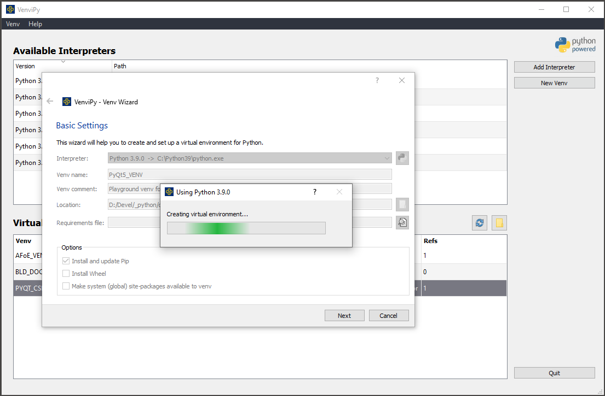
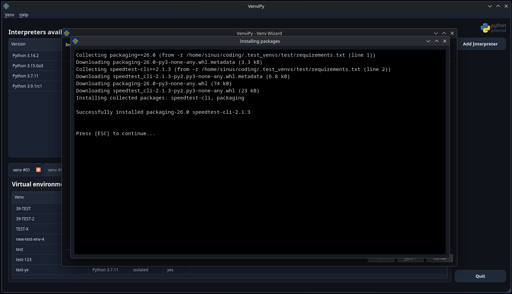

VenviPy
=======

**A GUI for managing multiple Python virtual environments**

.. image:: https://img.shields.io/badge/python-3.7+-blue
    :target: https://python.org

.. image:: https://img.shields.io/badge/pyqt-5.11+-blue
    :target: https://pypi.org/project/PyQt5

.. image:: https://img.shields.io/badge/platform-linux-darkblue
    :target: https://www.linux.org/pages/download

.. image:: https://img.shields.io/badge/code%20style-black-000000
    :target: https://github.com/psf/black

.. image:: https://img.shields.io/badge/license-MIT-darkviolet
    :target: https://github.com/sinusphi/venvipy/blob/master/LICENSE

Introduction
------------

*VenviPy* is a user friendly graphical interface for creating customized
virtual environments or modifing any existing Python environment (that
supports the built-in venv) quick and easy.

It provides useful features like a wizard, that guides the user through
the creation process, a table that shows an overview over installed
environments in a specific directory and a collection of context menu
actions like listing detailed information about an environment and much
more.

.. image:: ./img/screen-1.png

Features
--------

*  Create virtual environments from any Python version (3.3+) which is
   properly build or installed on your system
*  Install and update Pip with one click
*  Clone an environment from a requirements file
*  Search and install packages from `PyPI (Python Package
   Index) <https://pypi.org/>`__
*  Generate requirements from an existing environment
*  List detailed information about installed packages
*  Show dependency tree (using
   `pipdeptree <https://github.com/naiquevin/pipdeptree>`__ package)
*  Install packages from local projects and from repository urls *(git only)*
*  Modify any environment by adding or removing packages *(comming
   soon)*

Prerequisits
------------

Primarily *VenviPy* is aimed at \*NIX systems (maybe a Windows port could
come sometime in the future)

If you want to run *VenviPy* using your operating system's Python (3.7+)
you will have to make sure that the two packages ``python3-venv`` and
``python3-pip`` are installed, because in this case the operating system's
venv and pip will be used to perform the commands.

Installation
------------

You can install the latest version of *VenviPy* via:

.. code-block:: bash

    $ pip install venvipy

or

.. code-block:: bash

    $ pip install git+https://github.com/sinusphi/venvipy.git

and then run:

.. code-block:: bash

    $ sudo venvipy

**NOTE:** At the moment running *VenviPy* from the command line requires 
``sudo``. This will be fixed in the next release. 

Running from source
-------------------

If running *VenviPy* from source the recommended way is to use a virtual
environment. First clone or download the source repository. Then open a
terminal and run:

.. code-block:: bash

    $ python3.x -m venv [your_env_name]

Change to the created directory and run:

.. code-block:: bash

    $ source bin/activate

The easiest way to install the required packages is to use the
`requirements.txt <https://github.com/sinusphi/venvipy/blob/master/requirements.txt>`__
from the repository. Navigate to the downloaded repo and run:

.. code-block:: bash

    $ (your_env_name) pip install --requirement requirements.txt

Or install the `PyQt5 <https://pypi.org/project/PyQt5>`__ package by
running the following command:

.. code-block:: bash

    $ (your_env_name) pip install PyQt5 PyQt5-sip

Finally inside the repo cd into the ``venvipy/`` folder and run:

.. code-block:: bash

    $ (your_env_name) python venvi.py

Known issues
------------

When launching *VenviPy* from a virtual environment you'll have to choose 
the interpreter (the one that created the environment in which you're running 
*VenviPy* ) manually to be able to use it. 

For this in the main menu click on the ``Add Interpreter`` button in the
upper right corner. Then select the correct python binary file (e.g.
``/usr/local/bin/python3.x``) and you'll be able to use the added
interpreter.

Contributing
------------

Contributions are welcomed, as well as `Pull
requests <https://github.com/sinusphi/venvipy/pulls>`__, `bug
reports <https://github.com/sinusphi/venvipy/issues>`__, and `feature
requests <https://github.com/sinusphi/venvipy/issues>`__.
